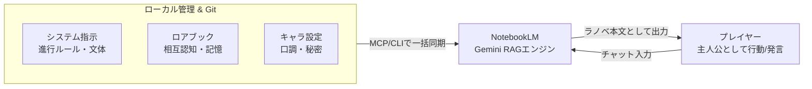

# 📖 Google NotebookLM 対話型ロールプレイ環境 (byNotebook)

> **「AIとの対話小説でよくある『キャラ崩壊』『設定忘れ』『不自然な全知化』を、Google NotebookLMのRAG技術とプロンプト制御で完全克服したシステム」**

---

## 🚀 これは何？（30秒でわかる概要）

Googleが提供する最新の資料特化型AI **「NotebookLM（Gemini）」** をMCP（Model Context Protocol）経由で自律連携させ、まるで**商業ライトノベルの主人公になったかのような没入感で遊べる対話型ストーリー環境**です。



---

## ✨ ここがすごい！4つのこだわり技術

### 1. 🎭 キャラクターの「全知化（知ったかぶり）」を完全防止
* **名前アンロックシステム**: 初対面の相手は「銀髪の少女」「三白眼の男」と見た目だけで描写され、名乗ったりIDを見て初めて正式な名前に切り替わります。
* **認知動線の義務化**: 設定資料に店名や秘密が書かれていても、作中で聞いていない情報は「その人はどこにいるの？（質問）」「端末で検索（調査）」といった動線がない限り勝手に知っている体で動きません。

### 2. 💬 オウム返しを排した「インターリーブ対話（掛け合い描写）」
ユーザーが複数のセリフや長文を入力した際、冒頭でまとめて要約・復唱するのではなく、**言葉と言葉の合間にNPCの視線や反応を挟み込みながら交互に描写**。最後のセリフを受けた後に最も手厚くドラマチックに返答します。

### 3. 🧠 相互認知マップによる「情報格差」の管理
「誰が誰を知っていて、誰がどの秘密を知らないか」をマトリクスで定義。
* *例：アレクはシエルが一目で軍用機と見抜くがハルには秘密にする／ルナは違法PFを追っているが目の前のシエルだとは気づかない*

### 4. ⚡ 特殊スラッシュコマンドで演出が変化
チャット中に特殊なコードを打ち込むだけで、裏エピソードを自在に召喚可能！
* **/日記**: ヒロインが密かに書いた「秘密の日記・観測ログ」を文末に描写
* **/心理**: キャラクターの「表には出さない内心の葛藤・本音」を開示
* **/幕間**: 主人公の知らない裏で起きている事件のサイドストーリーを描写
* **/イラスト**: 今のシーンを2Dセルアニメ調で描くための画像プロンプトを出力

---

## 🎬 実際の出力サンプル（抜粋）

```
ハル「うん、俺の師匠なんだ。ぶっきらぼうだけど、シエルみたいにすごく優しい師匠なんだよ。
……でもシエルちゃんのバッテリー、起きたら夢だったなんてあったら……」

シエルはすっと静かに歩み寄り、ハルの目の前で立ち止まった。
白のオーバーサイズパーカーの長い袖口から冷たい右手を伸ばすと、ハルの手にそっと触れる。

シエル「夢では、ありません」

鈴を転がすような澄んだ声音が、工房の静けさに染み渡る。

シエル「私の内部バッテリーは現在82%を維持しており、自律電力循環システムも正常です。ハル様が眠られている間に強制シャットダウンが起きる確率は0.003%以下です。……私が消えてしまうことは、ありません」

琥珀色の瞳を真っ直ぐにハルへ向け、シエルはそっと首を傾げた。

シエル「明日、ハル様が目を覚まされたその瞬間に、私が一番最初にご挨拶を申し上げます。『おはようございます』と、必ずお伝えしますから」
```

---

## 🛠 技術スタック
* **AI Brain**: Google NotebookLM (Gemini 1.5 Pro / RAG)
* **Integration**: `notebooklm-mcp` (MCP Server / CLI)
* **Version Control**: Git / Markdown
* **Environment**: Antigravity IDE
