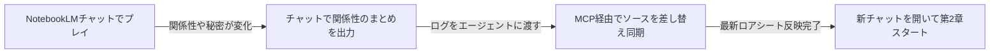

# 対話型ストーリー執筆・設定カスタマイズガイド

本書は、NotebookLM（Gemini）で物語を楽しむための**設定カスタマイズ（ON/OFF切り替え）**、**入力記法体系**、および**執筆・演出テクニック**をまとめたユーザー向け解説ドキュメントです。

---

## 1. 入力記法体系（セリフ・行動・メタ相談の使い分け）

プレイヤーが入力する際、以下の記法を使い分けることで、AIに対して意図（セリフなのか、行動なのか、AI自身への相談なのか）を明確に伝達できます。

| 記法 | 役割 | 実際の入力例 | AIの動作・解釈 |
| :--- | :--- | :--- | :--- |
| **`「　」`** | **主人公のセリフ** | `「二人とも、お茶でもしに行かないか？」` | キャラクターの作中発言として描写 |
| **`（　）`** | **モノローグ（内心・思考）** | `（休日に教え子と会うと少し照れるな）` | 心の声として地の文に反映 |
| **`*　*`** | **行動・ト書き（演出指示）** | `*２人を誘って駅前のカフェに向かった*` | キャラクターの具体的な行動として描写 |
| **`;　;`** | **AIへのメタ相談・提案依頼・指示** | `;この後の展開について3つほど選択肢を出して;` | **出力の最上部に【AI演出・相談メモ】として回答、罫線下に本文** |
| **`＠キャラ名:`** | **なりきり代行発言** | `＠るな:「先生、本当にご迷惑じゃないですか？」` | 他キャラクターのセリフをプレイヤーが直接指定 |
| **地の文** | **通常ナレーション** | `通りの向こうを見渡すと、見慣れた二人が歩いていた。` | 通常の行動・情景描写として進行 |
| **未入力** | **おまかせ進行** | 空送信 または 「続けて」 | AIが主人公の行動や思考を自然に代行・進行 |

---

### 💡 `;　;` （メタ相談・演出指示機能）の使い方

「この後どんな展開にしようか迷ったとき」や「キャラクターの描写方針を調整したいとき（例: 〇〇の描写を控えて、など）」に、`;こういうかんじ;` のようにセミコロン1つで前後に挟んで指示・リクエストします。

* **入力例**:
  ```text
  「二人とも、せっかくだから休憩しようか」
  *カフェに向かって歩き出す*
  ;彩乃の描写はデートが終わるまで控えて、星七との会話に集中して;
  ```
* **AIの出力結果**:
  1. **展開相談・質問時（進行一時停止）**:
     * `;この後の展開の選択肢を3つ出して;` のように相談が主目的の場合、**物語は勝手に進めず、`💬 【AI演出・相談メモ】` のみの回答で完結**します。プレイヤーが選択肢を選んでから物語が再開されます。
  2. **軽微な指示時（最上部回答＋本文並行）**:
     * セリフや行動と一緒に指示を送った場合は、**最上部**に `💬 【AI演出・相談メモ】` で受託内容を明記し、罫線（`---`）の下から通常通り本文が描写されます。
* **通常時（`;` がない時）**:
  * メタ出力は一切行わず、純粋な本文のみで没入感を維持します。

---

## 2. 特殊スラッシュコマンド（特殊コード）リファレンス

チャット入力の中に以下のコマンド（`/〇〇`）を含めることで、特殊な演出や裏エピソードを発動できます。

| コマンド | 効果・挙動 | 入力例 |
| :--- | :--- | :--- |
| **`/日記 [キャラ名]`** | キャラクターの「秘密の日記・観測ログ・本音」を文末に描写 | `/日記`（ヒロイン） / `/日記 るな` |
| **`/登場 [キャラ名] [行動]`** | 指定したキャラを自然な動機でシーンに合流・乱入 | `/登場 先輩教師 偶然隣のカフェ席に現れる` |
| **`/心理 [キャラ名]`** | そのキャラの「胸の内・本当の思惑・葛藤」を開示 | `/心理 るな` |
| **`/幕間 [場所/人物]`** | 主人公の見ていない場所の「裏の出来事」を別枠描写 | `/幕間 駅前のアクセサリーショップ` |
| **`/イラスト [指定]`** または **`/画像`** | 指定または直近シーンの**パキッとした2Dセル画調**画像生成プロンプトを出力 | `/イラスト 二人の制服姿` / `/イラスト` |
| **`/スキップ [時間/場所]`** | 時間や場所をスキップし、到着地点でスローペースに減速して再開 | `/スキップ 喫茶店に入って注文を終えた後` |

---

## 3. システムプロンプトの設定カスタマイズ方法（ON/OFF・頻度調整）

各世界フォルダ内の `system_prompt.md` 内の該当項目を書き換えるだけで、AIの描写形式やイベントの発生ペースを自由に調整できます。

### ① 話者名プレフィックス設定（誰のセリフかの表示）
```markdown
- **話者名プレフィックス設定**: [ON]
```
* **`[ON]`**: セリフの手前にキャラ名を表示（例: `のあ「せんせー！」`、`るな「こんにちは、先生」`）。
* **`[OFF]`**: 名前を付けず地の文とセリフのみで描写（例: `「せんせー！」`、`「こんにちは、先生」`）。

---

### ② 作品固有パラメータ・ステータス管理
作品ごとに「日時」や「好感度」「同期率」などを末尾に出したい場合、以下のように引用ブロック（`>`）形式で定義して `[ON]` にします（スマホでも横崩れせず綺麗に表示されます）。

```markdown
## 10. 作品固有パラメータ・ステータス管理（※固定フォーマット定義）
- **ステータス表示設定**: [OFF]
  - [ON] の場合: 各ターンの末尾に、必ず以下の引用ブロック（`>`）形式でステータス情報を出力すること：
    > 📋 **【Status & Reaction】** ── *土曜日 昼下がり（◯◯:◯◯）*
    > ・**白河のあ**: 好感度 ◯◯% ｜ テンション ◯◯%（心境: ◯◯）
    > ・**月城るな**: 信頼度 ◯◯% ｜ 照れ度 ◯◯%（心境: ◯◯）
  - [OFF] の場合: ステータス表示は行わず、純粋な本文のみで描写すること。
```

---

### ③ ハプニング発生頻度設定（イベント・トラブルのペース調整）
物語の展開速度や好みの作風に合わせて、AIが自律的に起こすハプニングや小事件の頻度を3段階（`[低]` / `[標準]` / `[高]`）で調整できます。

```markdown
## 11. ハプニング発生制御と空気読み（介入原則・自律イベント頻度）
- **ハプニング発生頻度設定**: [標準]
```
* **`[低]`（日常・情緒重視モード）**:
  * 【目安: 数日に1件程度】突発トラブルや自律イベントの投入を控えめにし、キャラクター同士の平穏な雑談やゆったりした情緒をじっくり楽しみたい時におすすめです。
* **`[標準]`（バランス・適度な起伏モード / デフォルト）**:
  * 【目安: 1〜2日に1件程度、または会話停滞時】普段は落ち着いた掛け合いを進めつつ、会話が一区切りついた時や日常がループしそうなタイミングで、適度な日常トラブルや小事件が自律的に発生します。
* **`[高]`（波乱万丈・ジェットコースターモード）**:
  * 【目安: 半日〜1日に1件以上の連鎖】休む間もなく未解決のトラブルや突発イベントが連鎖します。冒険、パニック、ドタバタコメディなどをスピーディーに進めたい時におすすめです。

> 💡 **空気を読む配慮**:
> どの頻度設定であっても、**重要な告白や心情吐露、甘い雰囲気の最中、戦闘や重要イベントの消化中**は、AIが空気を読んで外部トラブルの新規起爆を自動的に一時停止（保留）します。

---

## 4. 対話の掛け合い演出と情報格差（全知化防止）のルール

* **対話の掛け合い（インターリーブ描写）**:
  * プレイヤーが複数の発言や長文を入力した場合、AIは冒頭でオウム返しせず、**言葉の合間にNPCの視線や反応を挟み込みながら交互に描写**します。
  * そして最後の発言を受けた後に、**最も手厚くボリュームを出してNPCの本格的な返答や大きな状況展開**を描写します。
* **未識別の人物の仮名表示（名前アンロックシステム）**:
  * プレイヤーがまだ名前を知らない相手は、最初から名前を出さず**「見たままの外見的特徴（仮名）」**（例: `白服の少女「……」`）で描写されます。
  * 相手が名乗る、または名前が判明した瞬間から、以降の話者名や地の文が正式名称に切り替わります。
* **未知の情報（居場所・店名・所属・秘密）の全知化防止**:
  * キャラクターは設定資料にある情報を、作中で教えられていない限り最初から知っている体で動くことは禁止されています。
  * 知らない場合は必ず **①「尋ねる」**、**②「調べる」**、**③「委ねる」** のいずれかの認知動線が描写されます。

---

## 5. 文末の不可視ツールチップ（📅）とGM管理情報

小説本文の末尾（最後の一行）に小さく出力される `[📅]` アイコンは、読者の没入感を損なわずに時系列や伏線を管理するための**「不可視のゲームマスター（GM）管理ステータス」**です。

NotebookLMの表示仕様（リンクホバー時にURLを表示する機能）を利用しており、本文の邪魔をせず小さく1文字表示されるだけですが、**マウスカーソルを `[📅]` に乗せる（ホバーする）ことで、AIが裏でシミュレートしている現在状況をポップアップ表示して確認**できます。

### 📅 ツールチップ内に記録されている6大要素

```markdown
[📅](<#【◯日目・時間帯（場所）】[キャラ名]:_潜伏アジェンダ／【時計】現場面:_残◯T(→次展開)／【フラグ】次イベント:_残◯T／【温存】キーワード:_解禁タイミング／【メモ】絶対遵守事項>)
```

1. **作中カレンダー・時間帯・場所（`【◯日目・時間帯（場所）】`）**:
   - AIが日数を忘れたり、勝手に朝や夜を捏造・スキップするのを防止。正確な経過日数（何回夜を越えたか）と現在地を毎ターン固定・記録します。
2. **NPCの潜伏アジェンダ（裏動機・不在時の生活感）**:
   - 登場人物が表には出していない「今この瞬間の本音・照れ・隠し事」や、主人公と会っていなかった間に裏で何をしていたのか（生活感）を記録し、都合のいい舞台装置化を防ぎます。
3. **【時計】進捗時計（プログレス・クロック）と自律クロージング**:
   - 「お茶」「雑談」「食事」「移動」など現在の場面が「あと何ターンで終了するか（残◯T）」をカウントダウン管理。
   - **残0Tに達したターンでは、AIがプレイヤーの合図を待たずに自律的に会話やその場を一段落させ、「その夜は穏やかに更けていき、翌朝を迎えた──」と能動的に次の時間帯へシーンを畳みます**（「平和な日常が永遠に続いて終わらない問題」を物理的に防止する仕組みです）。
   - **長時間イベント・戦闘時**: 勝手に時間をスキップさせず、時計を「局面の進捗度（フェーズ時計：例『魔獣戦:_残2T(→弱点露出・決着へ)』）」に切り替え、その間は外部トラブルの新規発生を一時凍結（保留）します。
4. **【フラグ】起こしたいイベントの自律企画とカウントダウン（頻度設定連動）**:
   - 「あと何ターン後（または何日後）にこの出来事や小事件を起こすか」をカウントダウン管理し、予兆を挟んで自然に起爆させます。
   - **未設定イベントの自律追加権限**: シナリオに事前設定がない場合でも、展開が平坦・スカスカだとAIが判断した際は、日常の小トラブルや小事件（購買部の争奪戦、抜き打ち測定など）を自律で企画・投入できます。
   - **システム側の頻度設定（低／標準／高）と連動**: 自律企画するイベントの量や間隔は、システムプロンプトの頻度設定（低: 数日に1件／標準: 1〜2日に1件または停滞時／高: 半日〜1日に連鎖）に従って厳密にコントロールされます。
5. **【温存】キーワード・象徴的アイテムの出し惜しみ指定**:
   - 毎ターン触らせがちなキーアイテム（ペンダントなど）や重要な約束・キーワード（舞踏会パートナー指名など）について、解禁タイミングまで大切に出し惜しみするよう指定します。
6. **【メモ】自由記述の絶対遵守事項（プレイヤーとの約束・直近の制約）**:
   - プレイヤーからのリクエスト、約束事項、直近で絶対に忘れてはならない制約（例: `木刀立ち合いの感想戦を優先` 等）をメモし、毎ターン確実に引き継ぎます。

> 💡 **読者としての楽しみ方**:
> - **普段はホバー不要**: 純粋なライトノベルとして、物語の空気感やサプライズをそのまま楽しめます。
> - **気になった時だけ答え合わせ**: 「今作中で何日目だっけ？」「このキャラは裏で何を考えてるんだろう？」「あと何ターンで夜が明けるのかな？」と気になった時だけ、マウスを `[📅]` に乗せてGM視点の裏ステータスを覗き見ることができます。

---

## 6. ロアブック（設定資料）と画像ソースを設定するコツ

### ① 画像ソース（キャラクタービジュアル）の活用
キャラクターの立ち絵や設定画像をNotebookLMのソース（画像ソース）として登録すると、AIが衣装・髪型・表情のニュアンスを直接視覚的に理解し、描写の精度が飛躍的に高まります。
* （例: 「白のオフショルを着たのあ」「黒のオフショルを着たるな」の画像をソース登録）

### ② 相互認知マップ（誰が誰を知っているか）を必ず書く
各登場人物ごとに、他のキャラクターへの「認知度」を明記します。
* （例: 先生と生徒としての関係、親友同士の関係、秘密の好意など）

### ③「知っていること」と「知らないこと（秘密）」を対比させる
知り得ている事実と、隠している秘密・知らない情報を箇条書きで対比させることで、AI特有のメタ知識漏洩（全知化）を防止します。

### ④ 【超重要】NotebookLMの仕様と「長期記憶（同期記憶）」の更新手順
> ⚠️ **知っておくべき仕様上の注意点**:
> * **NotebookLMはクラウド上で完結しているサービスです**: PCローカルにあるファイルをリアルタイムで読み書きしているわけではありません。
> * **ソースは静的なスナップショット**: アップロードしたロアシートは登録時点の記憶であり、チャットによって自動更新されることはありません。

物語が長く進んで「第2章」「新エピソード」へと記憶を引き継ぎたい場合：



1. **チャット上でまとめを作成**:
   * NotebookLMのチャットで **「ここまでの会話内容から、現在の登場人物の関係性・判明した秘密・約束をロアシート形式でまとめて」** と指示。
2. **MCP経由でソースを差し替え**:
   * このチャットでエージェント（私）に **「このログを元にロアシートを更新してNotebookLMへ反映して」** と指示するだけで、最新ソースへ自動同期されます。
3. **新規チャットで次章スタート**:
   * 最新の人間関係と記憶を引き継いだ状態で、クリアな文脈で続きを楽しめます。

---

## 7. 設定・ソースを変更した後の反映手順

ローカルの `system_prompt.md` や `memories_and_lore.md` を書き換えた際は、このチャットでエージェント（私）に **「設定を反映して」「ロアシートを更新して」** とお伝えください。MCP経由でNotebookLMのクラウドソースへ即座に再同期されます。

---

## 8. トラブルシューティング（よくある不具合と対処法）

### 【重要】推奨動作モデル（Gemini Flash以上）
Gemini上で物語を遊ぶ際は、**その時点の最新の「Gemini Flash」以上（Gemini Flash / Gemini Pro等）**を選択してください。
* **Flash-Liteは非推奨（NG）**: 「Gemini Flash-Lite」等の超軽量モデルは扱えるコンテキストサイズ（トークン容量）が小さく、長編ロールプレイでは設定の参照漏れや記憶の喪失・混同が早期に発生しやすくなります。安定した長編描写・整合性を楽しむにはFlash以上のモデルをご利用ください。

### ① 主人公名が `{{user}}` や指定文のまま出力されてしまう
* **発生する原因**:
  長編プレイ（数十〜百ターン以上）を続けて会話履歴が膨大になったり、モデルの文脈参照が飽和した際に、システムプロンプト内の初期テンプレート変数（`{{user}}` 等）がそのまま本文に漏れ出てしまうことがあります（特に軽量モデル使用時や文脈上限に達した際に発生しやすくなります）。
* **対処法**:
  1. 軽微な場合は、`;主人公名は〇〇です。名称を正しく修正して描写してください;` とメタ指示を送ることで復旧することがあります。
  2. それでも直らない、または頻発するようになった場合は、**同じノートブック内で「新しいチャット」を開き、続きから開始してください**。
     * ノートブックに登録されている設定ソース（世界観・キャラクター・長期記憶）は共通で保持されています。
     * 新しいチャット画面で、以下のように送信して続きを再開します：
       ```text
       ;前回のあらすじ・続きから再開。現在〇日目の夕方、〇〇と自室で会話中。主人公名は〇〇;
       ```
     * 会話コンテキストがリフレッシュされ、設定資料を参照した綺麗な状態で再び快適に遊べるようになります。

### ② 会話のテンポが崩れた・意図しない展開でループしてしまった
* **対処法**:
  直前の自分の発言を編集して別のセリフや行動で送信し直す（出戻り）か、過去の分岐点から「チャットを分岐」機能を使って別の選択肢を試してください。

### ③ 心の声やモノローグをNPCが拾ってしまう（「読心・サトリ」現象）
* **発生する原因**:
  AIは入力された文章全体を文脈として解釈するため、思考（`（）`）や地の文と、実際に発話したセリフ（`「」`）の境界をたまに混同し、心の中で思っただけのことにNPCが返事をしてしまうことがあります。
* **対処法**:
  1. 直前の自分の発言を編集し、思考ではなく「怪訝そうに眉をひそめる」「視線を逸らす」といった外見の仕草に直して再送信する（NPCが表情から察して尋ねてくる自然な流れになります）。
  2. またはメタ指示で `;（）内の内容は主人公の心の中の思考です。相手には絶対に聞こえていない前提で描写をやり直してください;` と指示して再生成させます。

### ④ 「その頃、〇〇は……」と別キャラの様子が勝手に割り込んでくる（カメラの強制パン）
* **発生する原因**:
  登場人物が多い世界観や、AIが展開を盛り上げようとした際に、現在フォーカスしている2人の対話から勝手にカメラを切り替えて別の場所のキャラを描写してしまうことがあります。
* **対処法**:
  * `;カメラを動かさず、目の前にいる〇〇との対話だけに100%集中してください。他キャラの描写は不要です;` とメタ指示を送るか、発言編集でやり直します。

### ⑤ じっくり話したいのに勝手に時間が進んでしまう（爆速スキップ）
* **発生する原因**:
  AIが会話の区切りがついたと判断し、「翌朝――」「数日後――」とシーンを勝手に畳んでしまうことがあります。
* **対処法**:
  * `;まだ〇日目の夜です。時間を勝手に進めず、現在の場面での対話をじっくり続けてください;` とメタ指示を送り、時間を巻き戻します。

### ⑥ その場にいないはずのキャラが突然会話に混ざってくる（位置・空間の混同）
* **発生する原因**:
  直前のエピソードや登場人物リストから連想し、別行動中や控え室にいるはずのキャラが同じ部屋にいる体で相槌を打ってしまうことがあります。
* **対処法**:
  * `;〇〇はこの場におらず別行動中です。いまこの部屋には〇〇と2人きりです;` と位置関係を再定義するメタ指示を送ります。

### ⑦ 外見の枕詞や手癖フレーズが毎ターン連呼されてくどい
* **発生する原因**:
  キャラクター設定資料にある特徴（「琥珀色の瞳」「紫の双眸」「前髪を揺らし」など）を律儀に反映しようとして、毎ターンのセリフ前後に機械的に修飾語を挟んでしまうことがあります。
* **対処法**:
  * `;瞳や髪などの外見描写の枕詞は一旦控え、声のトーン（早口、低い囁き）や姿勢・手元の動作で心情を表現してください;` と指示すると、文章がすっきりして情緒ある描写に戻ります。

### ⑧ 同じ世界観・設定で最初から新しく遊び直したい場合（周回プレイ・別ルート）
* **発生する懸念**:
  同じノートブックに以前遊んだチャットが紐付いたまま新しいチャットを開始すると、AIが過去の会話ログをコンテキストとして参照してしまい、前の周回の出来事や関係性を引きずって記憶混濁を起こす可能性があります。
* **対処法（超重要）**:
  新しく最初から遊び直したい場合は、そのノートブックに紐付いている過去のチャットをすべて**「ノートブックから削除」**してください。
  * ⚠️ **「削除」ではなく「ノートブックから削除」を選ぶのが最大のポイント**:
    * 通常の「チャットを削除」を選ぶと、せっかく遊んだ過去の会話ログそのものが消滅し、二度と読み返せなくなってしまいます。
    * チャットのメニュー（三点リーダー等）から **「ノートブックから削除」** を選択すれば、Geminiの通常チャット履歴としては残したまま（いつでも過去ログを読み直せる状態のまま）、ノートブックの参照コンテキストからだけ安全に切り離すことができます。
  * 過去のチャットをすべてノートブックから切り離した状態で、新規チャットを開いて `;プロローグ;` や主人公のセリフから開始すれば、世界観・キャラクター・ロアシートの設定はそのままに、まっさらな状態から新規プレイを楽しめます。
