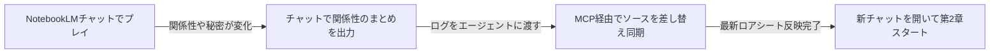

# 対話型ストーリー執筆・設定カスタマイズガイド

本書は、NotebookLM（Gemini）で物語を楽しむための**設定カスタマイズ（ON/OFF切り替え）**と**執筆テクニック**をまとめたユーザー向け解説ドキュメントです。

---

## 1. システムプロンプトのON/OFF切り替え方法

各世界フォルダ内の `system_prompt.md` 内の該当項目を `[ON]` または `[OFF]` に書き換えるだけで、AIの挙動が切り替わります。

### ① 話者名プレフィックス設定（誰のセリフかの表示）
```markdown
- **話者名プレフィックス設定**: [ON]
```
* **`[ON]`**: セリフの手前にキャラ名を表示（例: `シエル「……ハル様」`、`ルナ「ちょっとハル！」`）。
* **`[OFF]`**: 名前を付けず地の文とセリフのみで描写（例: `「……ハル様」`、`「ちょっとハル！」`）。

---

### ② 作品固有パラメータ・ステータス管理（第8項）
作品ごとに「日時」や「好感度」「同期率」などを末尾に出したい場合、第8項を**具体的な出力フォーマット**として定義します。

```markdown
## 8. 作品固有パラメータ・ステータス管理（※固定フォーマット定義）
- **ステータス表示設定**: [OFF]
  - [ON] の場合: 各ターンの末尾に、必ず以下の固定フォーマットでステータス情報を出力すること：
    ---
    【経過時間】◯日目 ◯◯:◯◯
    【好感度 / 同期率】
    ・シエル: 同期率 ◯◯%（心境: ◯◯）
    ・ルナ: 好感度 ◯◯% / 警戒度 ◯◯%（心境: ◯◯）
    ・アレク: 信頼度 ◯◯%（心境: ◯◯）
    ---
  - [OFF] の場合: ステータス表示は行わず、純粋な本文のみで描写すること。
```

> 💡 **ポイント**:
> 作品のジャンル（SF、学園ラブコメ、ダークファンタジー等）に合わせて、このブロックの中身を「あなたが欲しい項目・形式」に自由に書き換えてお使いいただけます。

---

## 2. 特殊スラッシュコマンド（特殊コード）リファレンス

チャット入力の中に以下のコマンド（`/〇〇`）を含めることで、特殊な演出や裏エピソードを発動できます。

| コマンド | 効果・挙動 | 入力例 |
| :--- | :--- | :--- |
| **`/日記 [キャラ名]`** | キャラクターの「秘密の日記・観測ログ・本音」を文末に描写 | `/日記`（ヒロイン） / `/日記 ルナ` |
| **`/登場 [キャラ名] [行動]`** | 指定したキャラを自然な動機でシーンに合流・乱入 | `/登場 アレク 面白いジャンクパーツを持って工房に来る` |
| **`/心理 [キャラ名]`** | そのキャラの「胸の内・本当の思惑・葛藤」を開示 | `/心理 シエル` |
| **`/幕間 [場所/人物]`** | 主人公の見ていない場所の「裏の出来事」を別枠描写 | `/幕間 上層区の監査局本部` |
| **`/イラスト` または `/画像`** | 今のシーンの2Dセルアニメ調画像生成プロンプトを出力 | `/イラスト` |
| **`/スキップ [時間/場所]`** | 時間や場所をスキップし、到着地点でスローペースに減速して再開 | `/スキップ 翌朝の学園の教室` |

---

## 3. 基本入力ルールと記法

* **主人公の行動・思考**: 通常の文章（地の文）で入力。
* **なりきり発言**: `＠[キャラ名]:` を先頭につけて発言（例: `＠ルナ:「なによそれ！」`）。
* **おまかせ展開（未入力）**: 空送信または「続けて」と送ると、AIが主人公の行動を自然に代行。
* **対話の掛け合い（インターリーブ描写）**:
  * プレイヤーが「発言A」「発言B」「発言C」と長文や連続セリフを入力した場合、AIは冒頭でオウム返しするのではなく、**言葉の合間にNPCの視線や反応を挟み込みながら交互に描写**します。
  * そして最後のセリフ（発言C）を受けた後に、**最も手厚くボリュームを出してNPCの本格的な返答や大きな状況展開**を描写します。

---

## 4. キャラクターの情報格差と「名前アンロック（認知動線）」のルール

* **未識別の人物の仮名表示（初対面）**:
  * プレイヤーがまだ名前を知らない相手は、最初から名前を出さず**「見たままの外見的特徴（仮名）」**で描写されます。
  * （例: `銀髪の少女「……」`、`金髪の制服少女「ちょっと！」`、`ゴーグルの男「よぉ」`）
* **名前のアンロック（名前判明時）**:
  * 相手が自己紹介する、プレイヤーが名前を尋ねる、またはIDや名札を見て名前が判明した瞬間から、**以降の話者名や地の文が正式名称（`シエル「〜」`、`ルナ「〜」`）に切り替わります**。
* **未知の情報（居場所・店名・所属・秘密）の全知化防止**:
  * キャラクターは設定資料にある「誰がどこにいるか（店名・住所）」「相手の所属や秘密」を作中で教えられていない限り、最初から知っている体で動くことは禁止されています。
  * 知らない場合は必ず **①「尋ねる（どちらにいるのですか？）」**、**②「調べる（端末網を照会）」**、**③「委ねる（案内をお願いします）」** のいずれかの動線が描写されます。

---

## 5. ロアブック（長期記憶・設定資料）を設定する際のコツ

ロアブック（`memories_and_lore.md`）は、AIが「誰が誰を知っていて、何を秘密にしているか」を正確に把握するための最も重要な設計図です。以下の5つのコツを押さえることで、破綻のない深い物語を楽しめます。

### ① 相互認知マップ（誰が誰を知っているか）を必ず書く
各登場人物ごとに、他のキャラクターへの「認知度」を1行ずつ明記します。
* **認知済み**: 「ハルの弟分・工房の場所も知っている」
* **全く知らない**: 「名前も居場所も存在すら知らない（ハルから聞くまで未知）」
* **名前だけ知っている**: 「上層区の監査官令嬢という噂だけ知っている」
* **秘密の看破**: 「面識はないが、一目見た瞬間に正体を見抜く」

> 💡 **効果**: 「初めて会ったはずなのに相手の店名や居場所を知っている」といったAI特有の全知化（メタ知識漏洩）を100%防げます。

### ②「知っていること」と「知らないこと（秘密）」を対比させる
各キャラクターごとに、知り得ている事実と、隠している秘密・知らない情報を箇条書きで対比させます。
* （例: アレクはシエルの正体を知っているが、ハルを巻き込まないため**秘密に伏せている**）
* （例: ルナは違法PFを追跡しているが、**それがシエルだとは気づいていない**）

### ③ 衣装・外見・装備を固定する
キャラクターの服装や持ち物をロアシートに明記し「固定」と定義しておくことで、ターンが進んでも勝手に服装が変わったり矛盾が生じるのを防ぎます。

### ④ 交わした約束・過去の思い出を蓄積する
物語の中で「今度一緒に星を見に行こう」「二人だけの秘密の合言葉」といった出来事が起きたら、ロアシートに追記して同期することで、AIがふとした沈黙や日常会話の中で自然に過去を想起してくれます。

### ⑤ 【超重要】NotebookLMの仕様と「長期記憶（同期記憶）」の現実
> ⚠️ **知っておくべき仕様上の注意点**:
> * **NotebookLMはクラウド上で完結しているサービスです**: PCローカルにある `memories_and_lore.md` をNotebookLMが直接リアルタイムで読み書きしているわけではありません。
> * **ソースは静的なスナップショット**: アップロードしたロアシートはあくまで「登録時点の初期記憶」であり、チャットのやり取りによって自動更新されることはありません。

物語が長く進んで「第2章」「新エピソード」へと記憶を引き継ぎたい場合の現実的な運用方法は以下の通りです：



1. **チャット上でまとめを作成**:
   * NotebookLMのチャットで **「ここまでの会話内容から、現在の登場人物の関係性・判明した秘密・約束をロアシート形式でまとめて」** と指示してテキストを出力させる。
2. **MCP経由でソースを差し替え（またはWebで手動更新）**:
   * このチャットでエージェント（私）に **「このログを元にロアシートを更新してNotebookLMへ反映して」** と投げるだけで、MCPがローカルファイルを更新しつつNotebookLM側のソースを自動で入れ替えます（※ブラウザ側で手動でソースを追加・メモ化しても構いません）。
3. **新規チャットで次章スタート**:
   * ソースが最新化されたため、過去の重いチャット履歴を捨てて新しいチャットを開いても、**最新の人間関係と記憶を引き継いだ状態で物語を継続**できます。

### ⑥ 表現規制（セーフティ）をすり抜けるSF・間接描写テクニック
* **恋愛・官能（NSFW）**:
  * 直接的な性行為単語は避け、**「視線・吐息・熱気・体温の共有」「朝チュン・暗転」**などの間接描写を活用すると極めて濃厚な雰囲気でも規制されずに楽しめます。
* **バトル・損壊（アンドロイド・SF特権）**:
  * 人体の直接損壊ではなく、**「擬似血液・人工筋肉・チタンフレーム・冷却液・動力炉」**などの機械・SF用語に置き換えることで、腕の切断や激しい損壊バトルも安全に迫真描写されます。

---

## 6. 設定・ソースを変更した後の反映手順

ローカルの `system_prompt.md` や `memories_and_lore.md` を書き換えた際は、このチャットでエージェント（私）に **「設定を反映して」「ロアシートを更新して」** とお伝えください。MCP経由でNotebookLMのクラウドソースへ即座に再同期されます。


