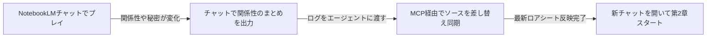

# 対話型ストーリー執筆・設定カスタマイズガイド

本書は、NotebookLM（Gemini）で物語を楽しむための**設定カスタマイズ（ON/OFF切り替え）**、**入力記法体系**、および**執筆・演出テクニック**をまとめたユーザー向け解説ドキュメントです。

---

## 1. 入力記法体系（セリフ・行動・メタ相談の使い分け）

プレイヤーが入力する際、以下の記法を使い分けることで、AIに対して意図（セリフなのか、行動なのか、AI自身への相談なのか）を明確に伝達できます。

| 記法 | 役割 | 実際の入力例 | AIの動作・解釈 |
| :--- | :--- | :--- | :--- |
| **`「　」`** | **主人公のセリフ** | `「二人とも、お茶でもしに行かないか？」` | キャラクターの作中発言として描写 |
| **`（　）`** | **モノローグ（内心・思考）** | `（休日に教え子と会うと少し照れるな）` | 心の声として地の文に反映 |
| **`*　*`** | **行動・ト書き（演出指示）** | `*２人を誘って駅前のカフェに向かった*` | キャラクターの具体的な行動として描写 |
| **`;;　;;`** | **AIへのメタ相談・提案依頼** | `;;この後の展開について3つほど選択肢を出して;;` | **本文とは別に、文末の【AI相談・提案メモ】で回答・提案** |
| **`＠キャラ名:`** | **なりきり代行発言** | `＠るな:「先生、本当にご迷惑じゃないですか？」` | 他キャラクターのセリフをプレイヤーが直接指定 |
| **地の文** | **通常ナレーション** | `通りの向こうを見渡すと、見慣れた二人が歩いていた。` | 通常の行動・情景描写として進行 |
| **未入力** | **おまかせ進行** | 空送信 または 「続けて」 | AIが主人公の行動や思考を自然に代行・進行 |

---

### 💡 `;;` （メタ相談・提案依頼機能）の使い方

「この後どんな展開にしようか迷ったとき」や「キャラクターの好物や設定をAIに確認したいとき」に `;;` で挟んで質問・リクエストします。

* **入力例**:
  ```text
  先生「二人とも、せっかくだから休憩しようか」
  *カフェ・アンジェリークに向かって歩き出す*
  ;;このあとカフェで起きる面白いハプニングの選択肢を3つ出して;;
  ```
* **AIの出力結果**:
  1. 通常通り、美しいライトノベル本文を描写（キャラには相談内容を認知させない）。
  2. 本文末尾に `---` を挟み、**【AI相談・提案メモ】** として質問への回答や選択肢（A案/B案/C案など）を提示。
* **通常時（`;;` がない時）**:
  * 選択肢などの余計なメタ出力は一切行わず、純粋な本文のみで没入感を維持します。

---

## 2. 特殊スラッシュコマンド（特殊コード）リファレンス

チャット入力の中に以下のコマンド（`/〇〇`）を含めることで、特殊な演出や裏エピソードを発動できます。

| コマンド | 効果・挙動 | 入力例 |
| :--- | :--- | :--- |
| **`/日記 [キャラ名]`** | キャラクターの「秘密の日記・観測ログ・本音」を文末に描写 | `/日記`（ヒロイン） / `/日記 るな` |
| **`/登場 [キャラ名] [行動]`** | 指定したキャラを自然な動機でシーンに合流・乱入 | `/登場 先輩教師 偶然隣のカフェ席に現れる` |
| **`/心理 [キャラ名]`** | そのキャラの「胸の内・本当の思惑・葛藤」を開示 | `/心理 るな` |
| **`/幕間 [場所/人物]`** | 主人公の見ていない場所の「裏の出来事」を別枠描写 | `/幕間 駅前のアクセサリーショップ` |
| **`/イラスト [指定]`** または **`/画像`** | 指定または直近シーンの**パキッとした2Dセル画調**画像生成プロンプトを出力 | `/イラスト 二人の制服姿` / `/イラスト` |
| **`/スキップ [時間/場所]`** | 時間や場所をスキップし、到着地点でスローペースに減速して再開 | `/スキップ 喫茶店に入って注文を終えた後` |

---

## 3. システムプロンプトのON/OFF切り替え方法

各世界フォルダ内の `system_prompt.md` 内の該当項目を `[ON]` または `[OFF]` に書き換えるだけで、AIの挙動が切り替わります。

### ① 話者名プレフィックス設定（誰のセリフかの表示）
```markdown
- **話者名プレフィックス設定**: [ON]
```
* **`[ON]`**: セリフの手前にキャラ名を表示（例: `のあ「せんせー！」`、`るな「こんにちは、先生」`）。
* **`[OFF]`**: 名前を付けず地の文とセリフのみで描写（例: `「せんせー！」`、`「こんにちは、先生」`）。

---

### ② 作品固有パラメータ・ステータス管理
作品ごとに「日時」や「好感度」「同期率」などを末尾に出したい場合、以下のように引用ブロック（`>`）形式で定義して `[ON]` にします（スマホでも横崩れせず綺麗に表示されます）。

```markdown
## 10. 作品固有パラメータ・ステータス管理（※固定フォーマット定義）
- **ステータス表示設定**: [OFF]
  - [ON] の場合: 各ターンの末尾に、必ず以下の引用ブロック（`>`）形式でステータス情報を出力すること：
    > 📋 **【Status & Reaction】** ── *土曜日 昼下がり（◯◯:◯◯）*
    > ・**白河のあ**: 好感度 ◯◯% ｜ テンション ◯◯%（心境: ◯◯）
    > ・**月城るな**: 信頼度 ◯◯% ｜ 照れ度 ◯◯%（心境: ◯◯）
  - [OFF] の場合: ステータス表示は行わず、純粋な本文のみで描写すること。
```

---

## 4. 対話の掛け合い演出と情報格差（全知化防止）のルール

* **対話の掛け合い（インターリーブ描写）**:
  * プレイヤーが複数の発言や長文を入力した場合、AIは冒頭でオウム返しせず、**言葉の合間にNPCの視線や反応を挟み込みながら交互に描写**します。
  * そして最後の発言を受けた後に、**最も手厚くボリュームを出してNPCの本格的な返答や大きな状況展開**を描写します。
* **未識別の人物の仮名表示（名前アンロックシステム）**:
  * プレイヤーがまだ名前を知らない相手は、最初から名前を出さず**「見たままの外見的特徴（仮名）」**（例: `白服の少女「……」`）で描写されます。
  * 相手が名乗る、または名前が判明した瞬間から、以降の話者名や地の文が正式名称に切り替わります。
* **未知の情報（居場所・店名・所属・秘密）の全知化防止**:
  * キャラクターは設定資料にある情報を、作中で教えられていない限り最初から知っている体で動くことは禁止されています。
  * 知らない場合は必ず **①「尋ねる」**、**②「調べる」**、**③「委ねる」** のいずれかの認知動線が描写されます。

---

## 5. ロアブック（設定資料）と画像ソースを設定するコツ

### ① 画像ソース（キャラクタービジュアル）の活用
キャラクターの立ち絵や設定画像をNotebookLMのソース（画像ソース）として登録すると、AIが衣装・髪型・表情のニュアンスを直接視覚的に理解し、描写の精度が飛躍的に高まります。
* （例: 「白のオフショルを着たのあ」「黒のオフショルを着たるな」の画像をソース登録）

### ② 相互認知マップ（誰が誰を知っているか）を必ず書く
各登場人物ごとに、他のキャラクターへの「認知度」を明記します。
* （例: 先生と生徒としての関係、親友同士の関係、秘密の好意など）

### ③「知っていること」と「知らないこと（秘密）」を対比させる
知り得ている事実と、隠している秘密・知らない情報を箇条書きで対比させることで、AI特有のメタ知識漏洩（全知化）を防止します。

### ④ 【超重要】NotebookLMの仕様と「長期記憶（同期記憶）」の更新手順
> ⚠️ **知っておくべき仕様上の注意点**:
> * **NotebookLMはクラウド上で完結しているサービスです**: PCローカルにあるファイルをリアルタイムで読み書きしているわけではありません。
> * **ソースは静的なスナップショット**: アップロードしたロアシートは登録時点の記憶であり、チャットによって自動更新されることはありません。

物語が長く進んで「第2章」「新エピソード」へと記憶を引き継ぎたい場合：



1. **チャット上でまとめを作成**:
   * NotebookLMのチャットで **「ここまでの会話内容から、現在の登場人物の関係性・判明した秘密・約束をロアシート形式でまとめて」** と指示。
2. **MCP経由でソースを差し替え**:
   * このチャットでエージェント（私）に **「このログを元にロアシートを更新してNotebookLMへ反映して」** と指示するだけで、最新ソースへ自動同期されます。
3. **新規チャットで次章スタート**:
   * 最新の人間関係と記憶を引き継いだ状態で、クリアな文脈で続きを楽しめます。

---

## 6. 設定・ソースを変更した後の反映手順

ローカルの `system_prompt.md` や `memories_and_lore.md` を書き換えた際は、このチャットでエージェント（私）に **「設定を反映して」「ロアシートを更新して」** とお伝えください。MCP経由でNotebookLMのクラウドソースへ即座に再同期されます。
